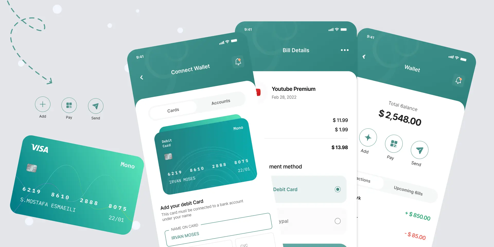

# SubTrack App

https://github.com/user-attachments/assets/06fae8b9-b7dc-46ca-9687-5030addecee6


  <td></td>
  <td></td>

A modern Android app for managing subscriptions, bills, and payments with a beautiful UI and optimized navigation.
## Built With  
<p align="left">  
    
    
</p>  

---
[Download Apk](https://github.com/najeebaslan/SubTrack/releases/download/v1.0.0/app-release.apk)
## ✨ Features

- **Wallet & Upcoming Bills**: View and manage all your upcoming subscription bills in one place.
- **Bill Details**: See detailed breakdowns for each bill, including service info, date, price, fee, and total.
- **Payment Flow**: Smooth, multi-step payment process:
  1. **Wallet** → 2. **Bill Details** → 3. **Bill Payment** → 4. **Payment Success**
- **Payment Methods**: Select and use different payment methods (Debit Card, PayPal, etc.).
- **Consistent Design**: Material Design 3, custom GradientButton, and unified card layouts.
- **Centralized Navigation**: Type-safe, maintainable navigation with `ScreenRoutes` and `NavigationHelper`.
- **Easy Data Passing**: Use NavController's saved state for passing models between screens.

---

## 🗂️ Project Structure

```
app/
  src/
    main/
      java/com/najeeb/subTrack/
        navigation/
          ScreenRoutes.kt         # Centralized route constants
          NavigationHelper.kt     # Helper methods for navigation
        screens/
          wallet/                # WalletScreen, components, and bill list
          bill_details/          # BillDetailsScreen
          bill_payment/          # BillPaymentScreen
          payment_successfully/  # PaymentSuccessfullyScreen
        data/
          TransactionDetailsModels.kt # Data models for bills and payments
      res/
        drawable/                # Icons and images
        ...
  ...
```

---

## 🚀 Navigation Optimization

- **All routes** are defined in `ScreenRoutes` for type safety and easy refactoring.
- **NavigationHelper** provides simple, reusable methods for all navigation actions.
- **Data passing** is handled via NavController's `savedStateHandle` with clear keys.

**Example:**
```kotlin
// Navigate to Bill Details
NavigationHelper.navigateToBillDetails(navController, bill)

// In NavHost
composable(ScreenRoutes.BILL_DETAILS) {
  val model = remember {
    navController.previousBackStackEntry?.savedStateHandle?.get<UpcomingBillsItem>(ScreenRoutes.Keys.BILL_MODEL)
  }
  // ...
}
```

---

## 💳 Bill & Payment Flow

1. **Wallet Screen**: See all upcoming bills. Tap a bill to view details.
2. **Bill Details Screen**: Review bill info, select payment method, tap "Pay Now" (uses GradientButton).
3. **Bill Payment Screen**: Confirm payment details, tap "Confirm and Pay" (uses GradientButton).
4. **Payment Successfully Screen**: See confirmation and return to home.

---

## 🛠️ Adding New Screens

1. Add a route to `ScreenRoutes`.
2. Add a navigation key if passing data.
3. Add a helper method to `NavigationHelper`.
4. Update `MoviesApp.kt` NavHost.

---

## 📦 Data Models

**BillDetailsModel** and **BillPaymentModel** are used for passing data between screens. Example:
```kotlin
data class BillPaymentModel(
  val serviceName: String,      // e.g., "Youtube Premium"
  val serviceIcon: Int,         // Drawable resource ID
  val paymentMethod: String,    // e.g., "BCA OneKlik"
  val price: String,           // e.g., "$ 11.99"
  val fee: String,             // e.g., "$ 1.99"
  val total: String            // e.g., "$13.98"
)
```

---

## 🖌️ Design Highlights

- **Material Design 3**: Modern, clean, and consistent UI.
- **GradientButton**: Custom button with gradient background and shadow.
- **Card Layouts**: Rounded corners, clear separation, and smooth transitions.
- **Interactive Payment Methods**: Radio button selection with visual feedback.

---

## 📚 Documentation

- [`NAVIGATION_OPTIMIZATION_README.md`](NAVIGATION_OPTIMIZATION_README.md): Navigation system details
- [`BILL_DETAILS_README.md`](BILL_DETAILS_README.md): Bill Details screen
- [`BILL_PAYMENT_README.md`](BILL_PAYMENT_README.md): Bill Payment screen
- [`PAYMENT_SUCCESSFULLY_README.md`](PAYMENT_SUCCESSFULLY_README.md): Payment Success screen

---

## 🏗️ Getting Started

1. **Clone the repo**
2. **Open in Android Studio**
3. **Build & Run** on your device or emulator

---

## 🤝 Contributing

Pull requests are welcome! For major changes, please open an issue first to discuss what you would like to change.

---

## 📄 License

[MIT](https://opensource.org/license/mit)
